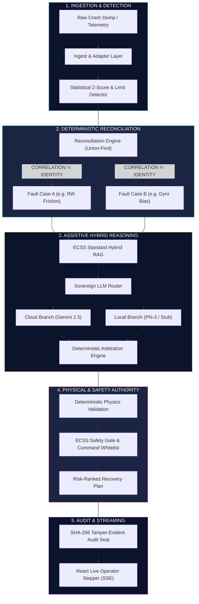

# 🛰️ SENTINEL SPACECRAFT FDIR COPILOT — END-TO-END SYSTEM FLOW & DIRECTORY ARCHITECTURE

```text
══════════════════════════════════════════════════════════════════════════════════════
  SENTINEL SPACECRAFT DIAGNOSTIC & RECOVERY COPILOT
══════════════════════════════════════════════════════════════════════════════════════
  Physics = Authority · Safety = Authority · LLM = Assistive · Reconciliation = Deterministic
  Core Axiom: CORRELATION ≠ IDENTITY (Separate faults must never be conflated)
══════════════════════════════════════════════════════════════════════════════════════
```

---

## 1. System Philosophy & Authority Architecture

SENTINEL is built upon a **Strict Authority Hierarchy**. In space operations, probabilistic models (LLMs) must **never** hold commanding authority. All physical truth, safety checks, and case separations are governed by deterministic algorithms.



---

## 2. Master Directory Architecture Map

```text
sentinel_version2/ (or SpaceAgent/)
├── README.md                                  # High-level mission and project overview
├── END_TO_END_FLOW.md                         # THIS FILE: Complete architectural execution flow
├── render.yaml                                # 1-click cloud backend deployment blueprint
├── sentinel/
│   ├── backend/                               # Python FastAPI Diagnostic Backend
│   │   ├── app/
│   │   │   ├── main.py                        # FastAPI application entry, CORS, routes & SSE stream
│   │   │   ├── startup_report.py              # Self-test diagnostic banner on boot
│   │   │   │
│   │   │   ├── agent/                         # Core Orchestration Subsystem
│   │   │   │   ├── agent.py                   # SentinelAgent: 17-stage pipeline orchestrator
│   │   │   │   ├── prompts.py                 # System and user prompt builders (strict schemas)
│   │   │   │   ├── rag.py                     # ChromaDB ECSS document retrieval bridge
│   │   │   │   └── safety.py                  # Safety gate adapter bridge
│   │   │   │
│   │   │   ├── detection/                     # Anomaly Detection Subsystem
│   │   │   │   ├── statistical.py             # Z-score and sliding-window statistical analysis
│   │   │   │   ├── limits.py                  # Hard red/yellow threshold verification
│   │   │   │   ├── temporal.py                # Temporal persistence and slope detection
│   │   │   │   ├── fusion.py                  # Multi-detector evidence fusion engine
│   │   │   │   ├── channels.py                # Spacecraft channel metadata and physical units
│   │   │   │   └── models.py                  # Anomaly observation data contracts
│   │   │   │
│   │   │   ├── reconciliation/                # Phase 24: Deterministic Case Separation
│   │   │   │   ├── engine.py                  # Union-Find disjoint set clustering engine
│   │   │   │   ├── cases.py                   # Case partitioning and relationship classifiers
│   │   │   │   ├── isolation.py               # Rigid case isolation and cross-contamination guard
│   │   │   │   ├── signals.py                 # Cross-subsystem propagation signal matrices
│   │   │   │   ├── rag_filter.py              # Case-scoped document retrieval filter
│   │   │   │   ├── events.py                  # SSE streaming events for live reconciliation view
│   │   │   │   └── contract.py                # Pydantic models for case separation contracts
│   │   │   │
│   │   │   ├── estimation/                    # Spacecraft Physics State Estimation
│   │   │   │   ├── state.py                   # Dynamic state snapshot builder
│   │   │   │   ├── residuals.py               # Conservation of momentum & energy residuals
│   │   │   │   ├── parameters.py              # Spacecraft physical constants (MOI, bus voltage)
│   │   │   │   └── window_adequacy.py         # Sampling adequacy checker for physics claims
│   │   │   │
│   │   │   ├── validation/                    # Deterministic Physics & Safety Authority
│   │   │   │   ├── physics.py                 # Deterministic physics engine (Torque, Energy, Heat)
│   │   │   │   ├── conditions.py              # Spacecraft state preconditions for commanding
│   │   │   │   ├── conflicts.py               # Toxic command pair conflict matrix
│   │   │   │   └── command_registry.py        # Whitelist of allowed ECSS recovery commands
│   │   │   │
│   │   │   ├── procedures/                    # ECSS Standard Procedure Subsystem
│   │   │   │   ├── library.py                 # Structured ECSS procedure catalog
│   │   │   │   ├── retrieval.py               # Hybrid semantic + keyword procedure retrieval
│   │   │   │   ├── citations.py               # Citation formatter (ECSS-E-ST-70-11C, etc.)
│   │   │   │   └── evaluation.py              # Procedure relevance evaluator
│   │   │   │
│   │   │   ├── llm/                           # Sovereign Hybrid LLM Router Subsystem
│   │   │   │   ├── router_orchestrator.py     # Dual-branch orchestrator (Cloud + Local)
│   │   │   │   ├── cloud_branch.py            # Gemini 2.5 Flash cloud inference branch
│   │   │   │   ├── local_branch.py            # Phi-3 / Qwen / Stub local inference branch
│   │   │   │   ├── arbitrator.py              # Deterministic arbitration (A1-A5 arbitration rules)
│   │   │   │   ├── merge_resolver.py          # Hypothesis conflict resolver
│   │   │   │   ├── branch_policy.py           # Sensitivity and routing decision engine
│   │   │   │   ├── explainer.py               # Plain-English routing rationale generator
│   │   │   │   └── provider.py                # LLM abstraction (Gemini, Ollama, Stub)
│   │   │   │
│   │   │   ├── security/                      # Spacecraft Security & Sovereignty Suite
│   │   │   │   ├── sanitization.py            # Telemetry input sanitization & injection filter
│   │   │   │   ├── redaction.py               # Proprietary mission parameter redaction
│   │   │   │   ├── exfiltration.py            # Secret and key exfiltration prevention
│   │   │   │   ├── auth.py                    # Fail-closed API key and role authentication
│   │   │   │   └── middleware.py              # FastAPI security and CORS headers middleware
│   │   │   │
│   │   │   ├── audit/                         # Cryptographic Audit Subsystem
│   │   │   │   ├── record.py                  # Immutable audit trail run recorder
│   │   │   │   └── store.py                   # SQLite / WAL persistent audit store
│   │   │   │
│   │   │   └── api/                           # API Models & Scenarios
│   │   │       ├── models.py                  # Pydantic schemas (SentinelOutput, SSEEvent)
│   │   │       ├── scenarios.py               # 10 ESA-ADB and canonical fault scenarios
│   │   │       ├── provenance.py              # Data provenance tracking (REAL / SYNTHETIC)
│   │   │       └── adapters.py                # Telemetry format canonicalization adapters
│   │   │
│   │   ├── data/                              # Data Assets
│   │   │   ├── ecss/                          # Ground-truth ECSS standards (PDFs)
│   │   │   ├── esa_crash_dumps/               # Real ESA Anomaly Database (ESA-ADB) metadata
│   │   │   ├── stub_response.json             # Canonical worked-example response (STUB mode)
│   │   │   └── audit/                         # SQLite audit database storage
│   │   │
│   │   ├── demo/                              # Interactive Command-Line Demo Runners
│   │   │   ├── run_e2e.py                     # Master E2E runner (Scenarios A, B, C, D, ALL)
│   │   │   └── reconciliation_demo.py         # Hero reconciliation interactive demonstration
│   │   │
│   │   └── tests/                             # 1,486 Unit, Integration & Security Tests
│   │
│   └── frontend/                              # Operator Console (React SPA)
│       ├── public/
│       │   ├── landing.html                   # 242 KB Standalone Mission Landing Page
│       │   ├── config.js                      # Dynamic runtime configuration (Backend URL)
│       │   └── vendor/                        # Offline Chart.js & Vis-Network libraries
│       ├── scripts/
│       │   └── generate-config.js             # Asset synchronizer and config generator
│       ├── src/
│       │   ├── App.jsx                        # Root React Router & Landing Page Switcher
│       │   ├── Console.jsx                    # Operator Console layout & Stepper header
│       │   ├── api/
│       │   │   └── client.js                  # Backend API & SSE streaming client
│       │   ├── components/                    # UI Components
│       │   │   ├── LivePipelineStepper.jsx    # Real-time 17-stage visual pipeline progress
│       │   │   ├── ReconciliationView.jsx     # Hero "CORRELATION ≠ IDENTITY" interactive view
│       │   │   ├── MissionOverview.jsx        # Spacecraft telemetry and status cards
│       │   │   ├── TelemetryViewer.jsx        # Multi-channel time-series charts
│       │   │   ├── InvestigationTab.jsx       # Reasoning trace, Thought/Observation stream
│       │   │   ├── PhysicsValidation.jsx      # Torque, Energy, and State residual cards
│       │   │   ├── RecoveryPlan.jsx           # ECSS recovery steps & Safety Gate status
│       │   │   ├── EvidenceViewer.jsx         # Case-scoped citations and telemetry bounds
│       │   │   ├── AuditViewer.jsx            # SHA-256 audit log inspection
│       │   │   └── EvaluationScorecard.jsx    # Benchmark metrics & accuracy scorecard
│       │   └── index.jsx                      # React DOM mounting entry point
│       ├── package.json                       # Frontend scripts and dependencies
│       └── vercel.json                        # Vercel deployment route rewrites and rules
```

---

## 3. End-to-End 17-Stage Diagnostic Pipeline Execution

When a spacecraft enters Safe Mode and ground control submits telemetry, SENTINEL processes the incident across **17 synchronized stages**:

```text
 ┌────────────────────────────────────────────────────────────────────────────────────────────────┐
 │                                SENTINEL 17-STAGE DIAGNOSTIC PIPELINE                           │
 └────────────────────────────────────────────────────────────────────────────────────────────────┘

  [01] INGESTION           Raw JSON / CCSDS crash dump ingested & sanitized (Input Redaction).
          │
  [02] CANONICALIZE        Window adapter normalizes timestamps, channel IDs, and physical units.
          │
  [03] ANOMALY DETECTION   Z-score, Hard Red/Yellow limit, and temporal persistence detectors run.
          │
  [04] STATE ESTIMATION    Dynamic state snapshots built; angular momentum & power residuals checked.
          │
  [05] RECONCILIATION      Union-Find clusters anomalies into disjoint Fault Cases (CORRELATION ≠ IDENTITY).
          │
  [06] CASE ISOLATION      Rigid security boundaries enforce case-isolated evidence partitioning.
          │
  [07] HYBRID RAG          Vector search queries ECSS-E-ST-70-11C manuals strictly within case context.
          │
  [08] SOVEREIGN ROUTER    Telemetry sensitivity evaluated (ITAR/Proprietary vs Public Standards).
          │
  [09] DUAL INFERENCE      Cloud Gemini 2.5 Flash and Local Phi-3/Stub generate candidate hypotheses.
          │
  [10] ARBITRATION         Deterministic arbitrator applies A1-A5 rules to select the winning hypothesis.
          │
  [11] PHYSICS VALIDATION  AOCS torque conservation, thermal dissipation, and bus power deterministically proven.
          │
  [12] SAFETY PRECHECKS    Spacecraft operational state preconditions verified against Command Registry.
          │
  [13] HAZARD BLOCKING     Toxic command combinations (e.g. concurrent thruster + wheel desat) BLOCKED.
          │
  [14] RECOVERY SYNTHESIS  Safe, ordered, risk-ranked ECSS recovery procedures generated.
          │
  [15] OPERATOR GATE       Deterministic evaluation of whether human ground authority sign-off is required.
          │
  [16] AUDIT SEALING       Cryptographic SHA-256 seal computed and written to persistent audit database.
          │
  [17] SSE STREAMING       Real-time events delivered to frontend; Live Pipeline Stepper visualizes stages.
```

---

## 4. Reconciliation Engine: "CORRELATION ≠ IDENTITY"

Reconciliation is SENTINEL's core architectural differentiator. In traditional systems, all anomalous telemetry is sent to an LLM as a single blob, causing **Fault Conflation** (e.g. diagnosing two simultaneous unrelated faults as a single imaginary mega-fault).

### The Sentinel Solution:
```text
  SCENARIO B: Reaction Wheel Friction + Gyroscope Bias

  TRADITIONAL LLM APPROACH (WRONG):
  Wheel Friction + Gyro Drift ──> LLM ──> "Reaction Wheel Drift Cascade" (HALLUCINATION)

  SENTINEL RECONCILIATION APPROACH (CORRECT):
  Telemetry ──> Anomaly Detection ──> Disjoint Set Clustering
                                            │
                     ┌──────────────────────┴──────────────────────┐
                     ▼                                             ▼
             CASE 001 (Actuator)                           CASE 002 (Sensor)
             Subsystem: AOCS                               Subsystem: AOCS
             Channel: Attitude_error_deg                   Channel: SEU_counter
             Cause: RW Bearings Friction                   Cause: Radiation Single-Event Upset
                     │                                             │
             Physics Validation: PASSED                    Physics Validation: PASSED
             Procedure: PROC-AOCS-001                      Procedure: PROC-AOCS-002
                     │                                             │
                     └───────────── Relationship: RELATED ─────────┘
                                   (merge_permitted = FALSE)
```

---

## 5. API Endpoint Specifications

| Method | Endpoint | Description | Response Type |
| :--- | :--- | :--- | :--- |
| `GET` | `/health` | Service health and operational readiness probe | `{"status": "ok"}` |
| `GET` | `/api/v1/scenarios` | Full catalog of 10 ESA-ADB and canonical test scenarios | `List[Scenario]` |
| `POST` | `/api/v1/analyze` | Initiates 17-stage analysis with Server-Sent Events (SSE) stream | `text/event-stream` |
| `GET` | `/api/v1/runs/{run_id}` | Retrieves immutable, SHA-256 sealed audit record for a past run | `AuditRunRecord` |
| `GET` | `/api/v1/scenarios/{id}/reconcile` | Direct dry-run inspection of deterministic case separation | `ReconciliationResult` |

---

## 6. Live Production Deployment URLs

| Service | Host | Live Production URL |
| :--- | :--- | :--- |
| **Operator Frontend** | Vercel | **[https://space-agent-fawn.vercel.app/](https://space-agent-fawn.vercel.app/)** |
| **Operator Dashboard** | Vercel | **[https://space-agent-fawn.vercel.app/dashboard](https://space-agent-fawn.vercel.app/dashboard)** |
| **Diagnostic Backend** | Cloudflare Workers | **[https://spaceagent.nitishbiswas0099.workers.dev/](https://spaceagent.nitishbiswas0099.workers.dev/)** |
| **Health Probe** | Cloudflare Workers | **[https://spaceagent.nitishbiswas0099.workers.dev/health](https://spaceagent.nitishbiswas0099.workers.dev/health)** |

---

## 7. How to Run Locally

### Running the Frontend
```bash
cd sentinel/frontend
npm run dev
# Landing Page:       http://localhost:3001
# Operator Dashboard: http://localhost:3001/dashboard
```

### Running the Backend
```bash
cd sentinel/backend
SECURE_DEV_MODE=1 RECONCILIATION_ENABLED=true SENTINEL_CORS_ORIGINS="*" .venv/bin/uvicorn app.main:app --host 0.0.0.0 --port 8000
```

### Running the End-to-End CLI Demo
```bash
cd sentinel/backend
.venv/bin/python -m demo.run_e2e --scenario ALL --reconciliation
```

### Running the 1,486 Automated Tests
```bash
cd sentinel/backend
.venv/bin/pytest -v
```
