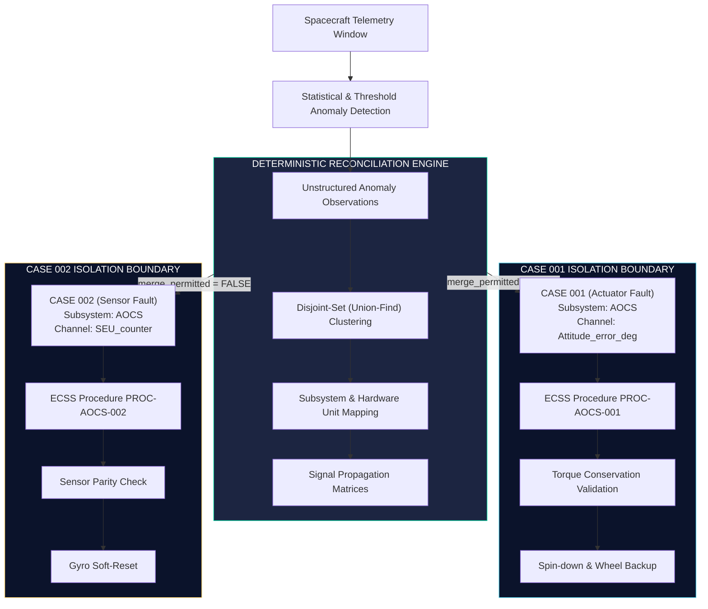

# 🧩 SENTINEL RECONCILIATION ENGINE

```text
══════════════════════════════════════════════════════════════════════════════════════
  OBSERVATION RECONCILIATION & CASE SEPARATION
══════════════════════════════════════════════════════════════════════════════════════
  Core Mathematical Axiom: CORRELATION ≠ IDENTITY
  Deterministic Case Partitioning · Rigid Isolation · Zero Fault Conflation
══════════════════════════════════════════════════════════════════════════════════════
```

---

## 1. Executive Summary & Problem Statement

In autonomous spacecraft Fault Detection, Isolation, and Recovery (FDIR), multiple anomalies frequently manifest simultaneously within the same telemetry window.

### The Critical Spacecraft Failure Mode: "Fault Conflation"
When two unrelated subsystems experience faults at the same time (e.g. a mechanical reaction wheel drag and a cosmic ray single-event upset on a gyroscope), conventional AI systems send all anomalous channels to an LLM in a single prompt.

This results in **Catastrophic Fault Conflation**:
- The LLM invents a single imaginary "mega-cascade" story connecting completely unrelated hardware.
- The ground operator is presented with a hallucinated root cause.
- Recovery commands for the wrong subsystem are scheduled, risking satellite loss.

```text
  TRADITIONAL LLM APPROACH (DANGEROUS):
  All Anomalies ──> LLM ──> "Single Conflated Mega-Fault" (HALLUCINATION)

  SENTINEL DETERMINISTIC RECONCILIATION (PROVEN SAFE):
  All Anomalies ──> Disjoint Set Clustering ──> Case A (Isolated) + Case B (Isolated)
```

---

## 2. Core Architectural Principle: $\text{CORRELATION} \neq \text{IDENTITY}$

SENTINEL enforces the deterministic rule that **temporal correlation does not imply physical identity**:

$$\text{TimeOverlap}(Obs_1, Obs_2) \centernot\implies \text{SameFault}(Obs_1, Obs_2)$$

Observations remain strictly separated into independent **Fault Cases** unless deterministically proven to originate from the exact same physical failure mechanism.



---

## 3. Mathematical Foundations & Algorithms

### 3.1. Union-Find Disjoint Set Clustering
Observations are partitioned into disjoint sets using a deterministic **Disjoint Set Union (DSU)** algorithm with near $O(1)$ amortized time complexity via path compression:

```python
class DisjointSet:
    def find(self, i: str) -> str:
        if self.parent[i] == i:
            return i
        self.parent[i] = self.find(self.parent[i])  # Path compression
        return self.parent[i]

    def union(self, i: str, j: str) -> None:
        root_i = self.find(i)
        root_j = self.find(j)
        if root_i != root_j:
            self.parent[root_i] = root_j
```

### 3.2. Relationship Classification Matrix
Between any two partitioned cases $C_i$ and $C_j$, the engine assigns a strictly typed relationship:

| Relationship Type | Definition | Merge Permitted? | Action Taken |
| :--- | :--- | :---: | :--- |
| **`IDENTICAL`** | Exact same hardware channel, timestamp, and signature | ✅ **YES** | Merge into single canonical case |
| **`RELATED`** | Same subsystem or known physical propagation path | ❌ **NO** | Keep cases isolated; draw causal link badge |
| **`INDEPENDENT`** | Distinct subsystems with no physical coupling | ❌ **NO** | Process completely in parallel |
| **`CONFLICTING`** | Contradictory telemetry readings on redundant sensors | ❌ **NO** | Trigger sensor degradation & ground review |

---

## 4. Scenario Walkthrough: Multi-Fault Separation (Scenario B)

SENTINEL's hero test case (`SCENARIO_B_TWO_SEPARATE_FAULTS`) demonstrates simultaneous faults in the Attitude and Orbit Control Subsystem (AOCS):

### Input Telemetry:
1. `Attitude_error_deg` = $+4.2^\circ$ (Exceeds $1.0^\circ$ safe threshold).
2. `SEU_counter` = $12$ (Exceeds nominal cosmic ray single-event threshold).

### Deterministic Engine Output:
```text
▶ RECONCILIATION SUMMARY (RECONCILIATION_ENABLED=true)
  • Principle:           CORRELATION != IDENTITY
  • Total Cases Formed:  2
  • Inter-Case Links:    1 (RELATED: intra-subsystem AOCS coupling)
  • Merge Permitted:     FALSE (Cases stay isolated)

  CASE 001: CASE-9d5348c73e0c
    Subsystem:           AOCS (Actuator Domain)
    Channels:            ['Attitude_error_deg']
    Isolated Evidence:   Reaction wheel friction torque mismatch
    ECSS Procedure:      PROC-AOCS-001 (Reaction Wheel Isolation)
    Physics Authority:   PASSED (Torque residual balance verified)

  CASE 002: CASE-bd57240de0a9
    Subsystem:           AOCS (Sensor Domain)
    Channels:            ['SEU_counter']
    Isolated Evidence:   Radiation bit-flip in gyro register
    ECSS Procedure:      PROC-AOCS-002 (Gyroscope Drift Isolation)
    Physics Authority:   PASSED (Sensor parity validated)
```

---

## 5. Rigid Case Isolation Security Boundaries

To prevent LLM cross-contamination, SENTINEL implements **Case-Scoped Isolation**:

1. **Scoped RAG Retrieval (`rag_filter.py`):**
   - RAG queries are parameterized by case subsystem. Case 001 never receives sensor recovery procedures; Case 002 never receives wheel motor procedures.
2. **Partitioned Physics Engine (`physics.py`):**
   - Physics consistency equations are solved per-case. A failure in Case 001's physics check does not invalidate Case 002.
3. **Independent Recovery Gating (`safety.py`):**
   - Hazardous command pre-checks are evaluated per case to prevent conflicting actuation.

---

## 6. Directory Code Map

The reconciliation subsystem is located in [`sentinel/backend/app/reconciliation/`](file:///Users/abhijeetkushwaha/Hackathon/space_Agent/sentinel_version2/sentinel/backend/app/reconciliation/):

| File | Subsystem Role |
| :--- | :--- |
| [`engine.py`](file:///Users/abhijeetkushwaha/Hackathon/space_Agent/sentinel_version2/sentinel/backend/app/reconciliation/engine.py) | Master Union-Find clustering and case construction engine |
| [`cases.py`](file:///Users/abhijeetkushwaha/Hackathon/space_Agent/sentinel_version2/sentinel/backend/app/reconciliation/cases.py) | Case partition models and relationship classifier logic |
| [`isolation.py`](file:///Users/abhijeetkushwaha/Hackathon/space_Agent/sentinel_version2/sentinel/backend/app/reconciliation/isolation.py) | Rigid evidence boundary enforcement and cross-talk guard |
| [`signals.py`](file:///Users/abhijeetkushwaha/Hackathon/space_Agent/sentinel_version2/sentinel/backend/app/reconciliation/signals.py) | Subsystem physical coupling and signal propagation matrices |
| [`rag_filter.py`](file:///Users/abhijeetkushwaha/Hackathon/space_Agent/sentinel_version2/sentinel/backend/app/reconciliation/rag_filter.py) | Case-scoped ECSS documentation filter |
| [`events.py`](file:///Users/abhijeetkushwaha/Hackathon/space_Agent/sentinel_version2/sentinel/backend/app/reconciliation/events.py) | SSE streaming event generator for live React UI view |
| [`contract.py`](file:///Users/abhijeetkushwaha/Hackathon/space_Agent/sentinel_version2/sentinel/backend/app/reconciliation/contract.py) | Pydantic data schemas for API endpoints and audit logging |

---

## 7. How to Test Reconciliation

### Command-Line Interactive Demo:
```bash
cd sentinel/backend
.venv/bin/python -m demo.reconciliation_demo
```

### Full Multi-Fault Separation Test (Scenario B):
```bash
cd sentinel/backend
.venv/bin/python -m demo.run_e2e --scenario B --reconciliation
```

### Automated Unit & Invariant Test Suite:
```bash
cd sentinel/backend
.venv/bin/pytest tests/test_phase24_reconciliation_*.py tests/test_phase6_reconciliation_hero.py -v
```
